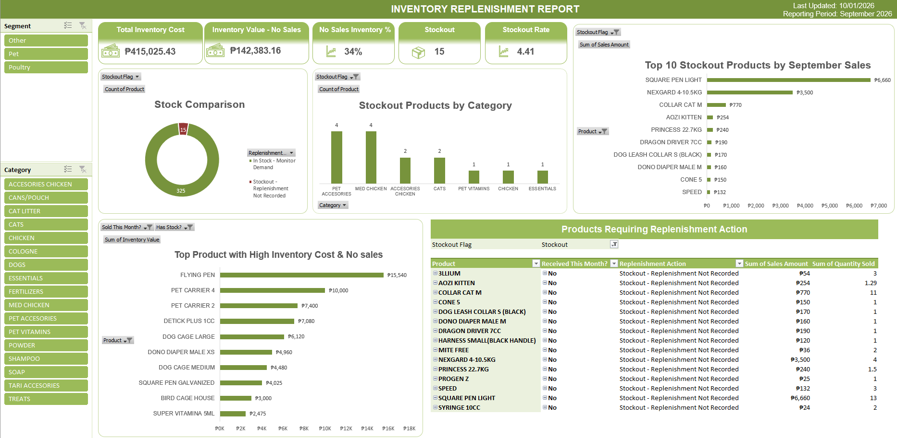

# Inventory & Replenishment Dashboard

## Overview

This project analyzes inventory, sales, and supplier-order data to monitor stock availability and evaluate replenishment conditions.

## Data

- 340 tracked products
- 15 products identified as stockout
- September 2026 sales and supplier-order records

## Objectives

- Monitor inventory availability
- Identify stockout products
- Review inventory value
- Compare stockouts with sales activity
- Evaluate replenishment activity using supplier records

## Process

1. Cleaned and standardized inventory, sales, and supplier-order data using Power Query
2. Standardized product names to ensure accurate matching between datasets
3. Combined inventory, sales, and supplier-order data at the product level
4. Classified replenishment conditions based on stock status, sales activity, and recorded supplier receipts
5. Built PivotTables, PivotCharts, KPIs, and slicers for analysis

## Replenishment Analysis

Stockout products were evaluated based on:

- Sales activity
- Recorded supplier receipts
- Current inventory status

## Dashboard

## Tools

- Microsoft Excel
- Power Query
- PivotTables
- PivotCharts

## Key Finding

15 products were identified as stockout products. These products were compared with September sales activity and recorded supplier receipts to identify replenishment conditions requiring review.
