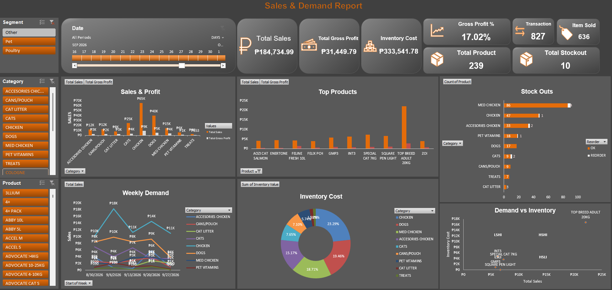

## Overview

This project analyzes September 2026 sales data to understand product demand, sales performance, and customer order activity.

## Data

- 1,347 sales lines
- 827 customer orders
- 190 distinct products
- Reporting period: September 2026

## Objectives

- Analyze sales by product and category
- Identify products with higher and lower sales activity
- Review order activity over time
- Support demand and purchasing decisions using sales data

## Process

1. Cleaned and standardized transaction data using Power Query
2. Transformed and summarized the sales data
3. Built PivotTables and PivotCharts
4. Added KPIs and interactive filters
5. Reviewed the results to identify demand patterns

## Tools

- Microsoft Excel
- Power Query
- PivotTables
- PivotCharts

## Dashboard

## Key Analysis

The dashboard provides views of sales performance, product demand, and order activity to support purchasing and inventory decisions.

